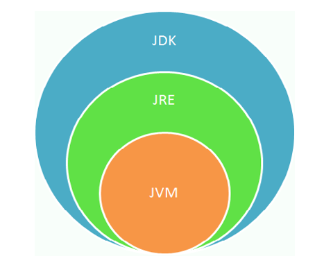
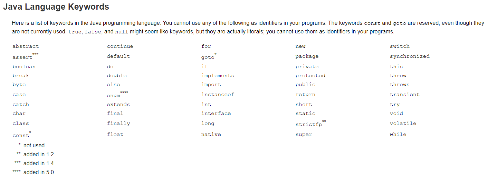
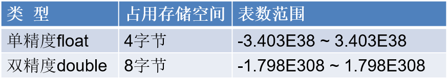
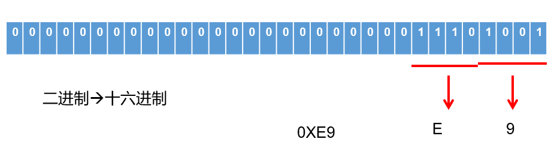
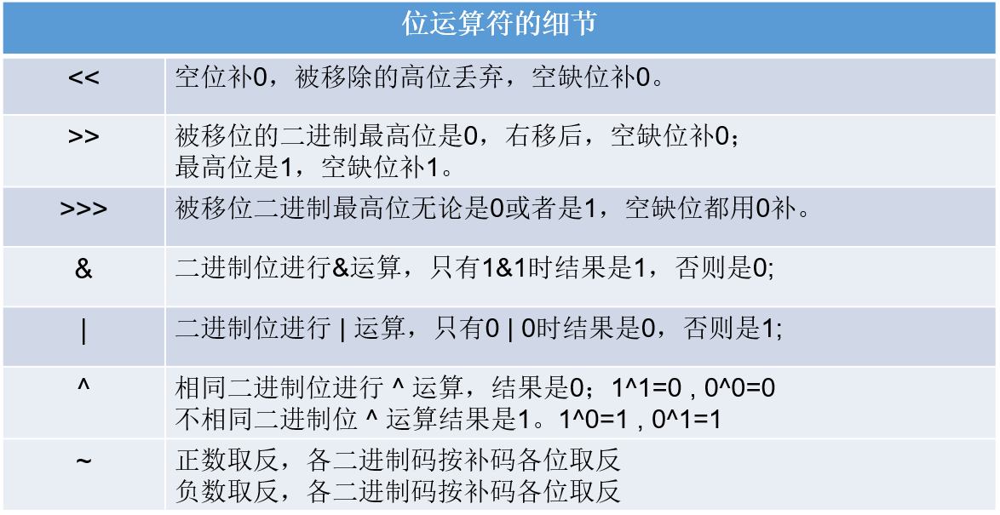
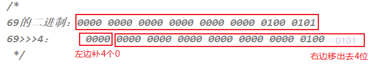
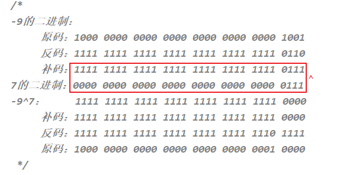
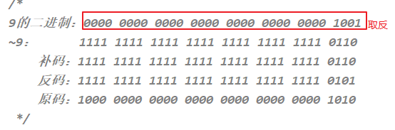
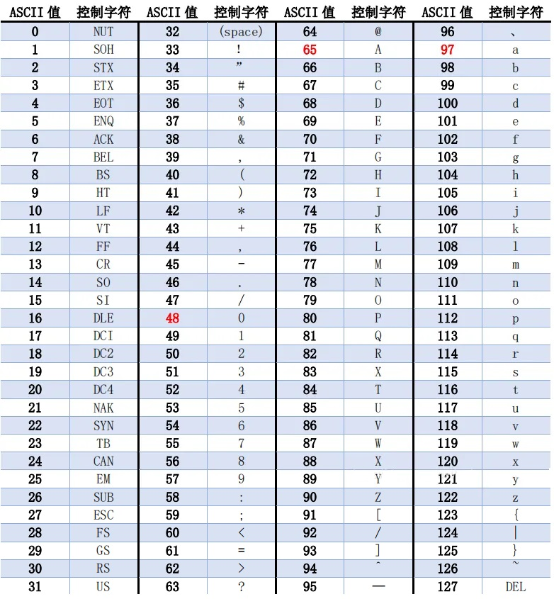

# 1 Java 基础

## 1.1 概述

**介绍：**

- 是`SUN`(Stanford University Network，斯坦福大学网络公司 ) `1995年`推出的一门高级编程语言。

- 是一种面向Internet的编程语言。Java一开始富有吸引力是因为Java程序可以在`Web浏览器`中运行。这些Java程序被称为`Java小程序`（applet），内嵌在HTML代码中。

- 伴随着互联网的迅猛发展，以及Java技术在web方面的不断成熟，已经成为Web应用程序的首选开发语言。

**起步：**

1991年，Sun公司的工程师小组想要设计一种语言，应用在`电视机`、`电话`、`闹钟`、`烤面包机`等家用电器的控制和通信。由于这些设备的`处理能力`和`内存`都很有限，并且不同的厂商会选择不同的中央处理器(CPU)，因此这种语言的关键是`代码短小`、`紧凑`且`与平台无关`（即不能与任何特定的体系结构捆绑在一起）。

Gosling团队率先创造了这个语言，并命名为“`Oak`"（起名的原因是因为他非常喜欢自己办公室外的橡树)。后因智能化家电的市场需求没有预期的高，Sun公司放弃了该项计划。

随着20世纪90年代互联网的发展，Sun公司发现该语言在互联网上应用的前景，于是改造了Oak，于1995年5月以Java的名称正式发布。（Java是印度尼西亚`爪哇岛`的英文名称，因盛产咖啡而闻名。）

**发展：**

|   发行版本    |    发行时间    |                             备注                             |
| :-----------: | :------------: | :----------------------------------------------------------: |
|   Java 1.0    |   1996.01.23   |             Sun公司发布了Java的第一个开发工具包              |
|   Java 1.1    |   1997.02.19   |        JavaOne会议召开，创当时全球同类会议规模之最。         |
|   Java 1.2    |   1998.12.08   |  Java拆分成：J2SE（标准版）、J2EE（企业版）、J2ME（小型版）  |
|   Java 1.3    |   2000.05.08   |                                                              |
|    Java1.4    |   2004.02.06   |                                                              |
| **Java 5.0**  | **2004.09.30** | **①版本号从1.4直接更新至5.0；②平台更名为JavaSE、JavaEE、JavaME** |
|   Java 6.0    |   2006.12.11   |               2009.04.20 Oracle宣布收购SUN公司               |
|               |   2009.04.20   |           Oracle公司收购SUN，交易价格`74亿`美元。            |
|   Java 7.0    |   2011.07.02   |                                                              |
| **Java 8.0**  | **2014.03.18** | **此版本是继Java 5.0以来变化最大的版本。是长期支持版本（LTS）** |
|   Java 9.0    |   2017.09.22   | ①此版本开始，**每半年更新一次**；②Java 9.0开始不再支持windows 32位系统 |
|   Java 10.0   |   2018.03.21   |                                                              |
| **Java 11.0** | **2018.09.25** |    **JDK安装包取消独立JRE安装包，是长期支持版本（LTS）**     |
|   Java 12.0   |   2019.03.19   |                                                              |
|      ...      |      ...       |                                                              |
| **Java17.0**  |  **2021.09**   |    **发布Java 17.0，版本号也称为21.9，是长期支持版本。**     |
|      ...      |      ...       |                                                              |
|   Java19.0    |    2022.09     |               发布Java19.0，版本号也称为22.9。               |

**高斯林：**

- `詹姆斯·高斯林(James Gosling)`先生以“Java 技术之父”而闻名于世。他是Java 技术的创始人，他亲手设计了Java语言，并开发了Java编译器和Java虚拟机，使Java成为了世界上最流行的开发语言。
- James Gosling于1984 年加入Sun公司，并一直服务于Sun公司，直至2010年前后，Sun被Oracle并购而加入Oracle，担任客户端软件集团的首席技术官; 2010年4月从Oracle离职。

**体系：**

- **Java SE(Java Standard Edition)标准版**
  - 支持面向`桌面级应用`（如Windows下的应用程序）的Java平台，即定位个人计算机的应用开发。
  - 包括用户界面接口AWT及Swing，网络功能与国际化、图像处理能力以及输入输出支持等。
  - 此版本以前称为J2SE
- **Java EE(Java Enterprise Edition)企业版**
  - 为开发企业环境下的应用程序提供的一套解决方案，即定位`在服务器端的Web应用开发`。
  - JavaEE是JavaSE的扩展，增加了用于服务器开发的类库。如：Servlet能够延伸服务器的功能，通过请求-响应的模式来处理客户端的请求；JSP是一种可以将Java程序代码内嵌在网页内的技术。
  - 版本以前称为J2EE
- **Java ME(Java Micro Edition)小型版**
  - 支持Java程序运行在`移动终端（手机、机顶盒）上的平台`，即定位在消费性电子产品的应用开发
  - JavaME是JavaSE的内伸，精简了JavaSE 的核心类库，同时也提供自己的扩展类。增加了适合微小装置的类库：javax.microedition.io.*等。
  - 此版本以前称为J2ME


**优点：**

* **跨平台性：**这是 Java 的核心优势。Java 在最初设计时就很注重移植和跨平台性。比如：Java 的 int 永远都是 32 位。不像 C++ 可能是 16，32，可能是根据编译器厂商规定的变化。
  * 通过 Java 语言编写的应用程序在不同的系统平台上都可以运行。“`Write once , Run Anywhere`”。
  * 原理：只要在需要运行 java 应用程序的操作系统上，先安装一个 Java 虚拟机 JVM (`J`ava `V`irtual `M`achine) 即可。由 JVM 来负责 Java 程序在该系统中的运行。

* **面向对象性：**

  面向对象是一种程序设计技术，非常 `适合大型软件的设计和开发`。面向对象编程支持封装、继承、多态等特性，让程序更好达到 `高内聚`，`低耦合 `的标准。

* **健壮性：**吸收了 C/C++ 语言的优点，但去掉了其影响程序健壮性的部分（如指针、内存的申请与释放等），提供了一个相对安全的内存管理和访问机制。

* **安全性高：**

  Java 适合于网络/分布式环境，需要提供一个安全机制以防恶意代码的攻击。如：`安全防范机制`（ClassLoader 类加载器），可以分配不同的命名空间以防替代本地的同名类、字节代码检查。

* **简单性：**

  Java 就是 C++ 语法的 `简化版`，我们也可以将 Java 称之为“`C++--`”。比如：头文件，指针运算，结构，联合，操作符重载，虚基类等。

* **高性能：**

  - Java 最初发展阶段，总是被人诟病“`性能低`”；客观上，高级语言运行效率总是低于低级语言的，这个无法避免。Java 语言本身发展中通过虚拟机的优化提升了 `几十倍运行效率`。比如，通过 JIT(JUST IN TIME) 即时编译技术提高运行效率。

  - `Java低性能的短腿，已经被完全解决了`。业界发展上，我们也看到很多 C++ 应用转到 Java 开发，很多 C++ 程序员转型为 Java 程序员。

**缺点：**

- `语法过于复杂、严谨`，对程序员的约束比较多，与 python、php 等相比入门较难。但是一旦学会了，就业岗位需求量大，而且`薪资待遇节节攀升`。
- 一般适用于大型网站开发，`整个架构会比较重`，对于初创公司开发和维护人员的成本比较高（即薪资高），选择用 Java 语言开发网站或应用系统的需要一定的经济实力。
- `并非适用于所有领域`。比如，Objective C、Swift 在 iOS 设备上就有着无可取代的地位。浏览器中的处理几乎完全由 JavaScript 掌控。Windows 程序通常都用 C++ 或 C# 编写。Java 在服务器端编程和跨平台客户端应用领域则很有优势。

## 1.2 JDK、JRE

- **JDK**  (`J`ava `D`evelopment `K`it)：是Java程序开发工具包，包含`JRE` 和开发人员使用的工具。
- **JRE ** (`J`ava `R`untime `E`nvironment) ：是Java程序的运行时环境，包含`JVM` 和运行时所需要的`核心类库`。

如下是 Java 8.0 Platform：




> 小结：
>
> JDK = JRE + 开发工具集（例如Javac编译工具等）
>
> JRE = JVM + Java SE标准类库

## 1.3 IDEA


## 1.4 HelloWorld

### 1.4.1 开发步骤

Java程序开发三步骤：**编写**、**编译**、**运行**。
- 将 Java 代码**编写**到扩展名为 .java 的源文件中
- 通过 javac.exe 命令对该 java 文件进行**编译**，生成一个或多个字节码文件
- 通过 java.exe 命令对生成的 class 文件进行**运行**


### 1.4.2 编写

1. 新建文件名为 `HelloWorld.java` 的文件。

2. 在文件中输入如下代码，并且保存

```java
class HelloWorld {
  	public static void main(String[] args) {
    	System.out.println("HelloWorld!!");
  	}
}
```

第一个 `HelloWord` 源程序就编写完成了，但是这个文件是程序员编写的，JVM 是看不懂的，也就不能运行，因此我们必须将编写好的` Java源文件` 编译成JVM可以看懂的 `字节码文件`，也就是 `.class` 文件。

**注意：**

- Java 严格区分大小写
- 如果类是 public，那么要求源文件名必须与类名一致，否则编译报错。
- 建议不管是否是 public，都与源文件名保持一致，而且一个源文件尽量只写一个类，好维护。
- Java 程序的入口是 main 方法

### 1.4.3 编译

在命令行中，进入文件所在目录，使用 `javac` 命令进行编译。

```java
javac HelloWord.java
```

编译成功后打开目录，发现产生了一个新的文件 `HelloWorld.class`，该文件就是编译后的文件，是 Java 的可运行文件，称为**字节码文件**，有了字节码文件，就可以运行程序了。 

**注意：**

- 一个源文件中可以有多个类，编译后会生成多个 .class 字节码文件。

- 但是一个源文件只能有一个public的类。

### 1.4.4 运行

在命令行中，进入字节码文件所在目录，使用 `java` 命令进行运行。

```java
java HelloWord // 不需要写上字节码文件的 .class
```

## 1.5 JVM 简介

**JVM **(`J`ava `V`irtual `M`achine)，Java 虚拟机，是 Java 程序的运行环境。JVM 具有指令集并使用不同的存储区域，负责执行指令，管理数据、内存、寄存器。

- Java 代码都运行在 JVM 之上。正是因为有了 JVM，才使得 Java 程序具备了跨平台性。

- Java 程序在运行过程中，涉及到运算的 `数据的分配`、`存储 `等都由 JVM 来完成。
- Java 消除了程序员回收无用内存空间的职责。提供了一种系统级线程跟踪存储空间的分配情况，在内存空间达到相应阈值时，检查并释放可被释放的存储器空间。
- GC的自动回收，提高了内存空间的利用效率，也提高了编程人员的效率，很大程度上 `减少了` 因为没有释放空间而导致的 `内存泄漏`。

# 2 变量与运算符

## 2.1 关键字

- 定义：**被Java语言赋予了特殊含义，用做专门用途的字符串（或单词）**
  - HelloWorld案例中，出现的关键字有 `class`、`public `、`static`、`void` 等，这些单词已经被 Java 定义好了。
- 特点：全部关键字都是 `小写字母`。
- 官方地址： https://docs.oracle.com/javase/tutorial/java/nutsandbolts/_keywords.html



>  说明：
>
>  1. 关键字一共 `50个`，其中 `const` 和 `goto` 是 `保留字` (reserved word)。
>  2. `true`，`false`，`null `不在其中，它们看起来像关键字，其实是字面量，表示特殊的布尔值和空值。


## 2.2 标识符

Java 中变量、方法、类等要素命名时使用的字符序列，称为标识符。

技巧：凡是自己可以起名字的地方都叫标识符。

**标识符的命名规则**（必须遵守的 `硬性规定`）：

- 由26个英文字母大小写，0-9 ，_或 $ 组成
- 数字不可以开头
- 不可以使用关键字和保留字，但能包含关键字和保留字
- Java中严格区分大小写，长度无限制
- 标识符不能包含空格

**标识符的命名规范**（建议遵守的 `软性要求`，否则工作时容易被鄙视）:

- 包名：多单词组成时所有字母都小写：xxxyyyzzz。
  例如：java.lang、com.atguigu.bean

- 类名、接口名：多单词组成时，所有单词的首字母大写：XxxYyyZzz
  例如：HelloWorld，String，System等

- 变量名、方法名：多单词组成时，第一个单词首字母小写，第二个单词开始每个单词首字母大写：xxxYyyZzz
  例如：age,name,bookName,main,binarySearch,getName

- 常量名：所有字母都大写。多单词时每个单词用下划线连接：XXX_YYY_ZZZ
  例如：MAX_VALUE,PI,DEFAULT_CAPACITY

注意：在起名字时，为了提高阅读性，要尽量有意义，“见名知意”。

## 2.3 变量

- 内存中的一个存储区域，该区域的数据可以在同一类型范围内不断变化

- 变量的构成包含三个要素：`数据类型`、`变量名`、`存储的值`

- Java中 变量声明的格式：`数据类型 变量名 = 变量值


- 变量的作用：用于在内存中保存数据。

- 使用变量注意：

  - Java中每个变量必须先声明，后使用。
  - 使用变量名来访问这块区域的数据。
  - 变量的作用域：其定义所在的一对{ }内。
  - 变量只有在其`作用域`内才有效。出了作用域，变量不可以再被调用。
  - 同一个作用域内，不能定义重名的变量。

## 2.4 数据类型

Java 中变量的数据类型分为两大类：

- **基本数据类型**：包括 `整数类型`、`浮点数类型`、`字符类型`、`布尔类型`。 

- **引用数据类型**：包括 `数组`、 `类`、`接口`、`枚举`、`注解`、`记录`。 

  

### 2.4.1 整数类型

byte、short、int、long

- Java 各整数类型有固定的表数范围和字段长度，不受具体操作系统的影响，以保证 Java 程序的可移植性。


- 定义 long 类型的变量，赋值时需要以"`l`"或"`L`"作为后缀。

- Java 程序中变量通常声明为 int 型，除非不足以表示较大的数，才使用 long。

- Java 的整型常量默认为 int 型。

### 2.4.2 浮点类型

float、double

- 与整数类型类似，Java 浮点类型也有固定的表数范围和字段长度，不受具体操作系统的影响。



- 浮点型常量有两种表示形式：
  - 十进制数形式。如：5.12       512.0f        .512   (必须有小数点）
  - 科学计数法形式。如：5.12e2      512E2     100E-2
- float：`单精度`，尾数可以精确到 7 位有效数字。很多情况下，精度很难满足需求。    
- double：`双精度`，精度是 float 的两倍。通常采用此类型。
- 定义 float 类型的变量，赋值时需要以"`f`"或"`F`"作为后缀。
- Java 的浮点型常量默认为 double 型。

**关于浮点型精度的说明：**

- 并不是所有的小数都能可以精确的用二进制浮点数表示。二进制浮点数不能精确的表示0.1、0.01、0.001这样10的负次幂。
- 浮点类型 float、double 的数据不适合在 `不容许舍入误差` 的金融计算领域。如果需要`精确`数字计算或保留指定位数的精度，需要使用`BigDecimal类`。

### 2.4.3 字符类型

char

- char 型数据用来表示通常意义上“`字符`”（占2字节）

- Java 中的所有字符都使用 Unicode 编码，故一个字符可以存储一个字母，一个汉字，或其他书面语的一个字符。

- 字符型变量的三种表现形式：

  - **形式1：**使用单引号(' ')括起来的`单个字符`。

    例如：char c1 = 'a';   char c2 = '中'; char c3 =  '9';

  - **形式2：**直接使用 `Unicode值`来表示字符型常量：‘`\uXXXX`’。其中，XXXX代表一个十六进制整数。

    例如：\u0023 表示 '#'。

  - **形式3：**Java中还允许使用`转义字符‘\’`来将其后的字符转变为特殊字符型常量。

    例如：char c3 = '\n';  // '\n'表示换行符

  | 转义字符 |  说明  | Unicode表示方式 |
  | :------: | :----: | :-------------: |
  |   `\n`   | 换行符 |     \u000a      |
  |   `\t`   | 制表符 |     \u0009      |
  |   `\"`   | 双引号 |     \u0022      |
  |   `\'`   | 单引号 |     \u0027      |
  |   `\\`   | 反斜线 |     \u005c      |
  |   `\b`   | 退格符 |     \u0008      |
  |   `\r`   | 回车符 |     \u000d      |

- char 类型是可以进行运算的。因为它都对应有 Unicode 码，可以看做是一个数值。

### 2.4.4 布尔类型

boolean

- boolean 类型用来判断逻辑条件，一般用于流程控制语句中：
  - if 条件控制语句；                  
  - while 循环控制语句；     
  - for 循环控制语句；
  - do-while 循环控制语句； 
- **boolean 类型数据只有两个值：true、false，无其它。**
  - 不可以使用 0 或非 0 的整数替代 false 和 true，这点和 C 语言不同。
  - 拓展：Java 虚拟机中没有任何供 boolean 值专用的字节码指令，Java 语言表达所操作的 boolean 值，在编译之后都使用 java 虚拟机中的 int 数据类型来代替：true 用 1 表示，false 用 0 表示。——《java虚拟机规范 8版》

## 2.5 基本数据类型变量间运算规则

在 Java 程序中，不同的基本数据类型（只有7种，不包含 boolean 类型）变量的值经常需要进行相互转换。

转换的方式有两种：`自动类型提升 `和 `强制类型转换`。

### 2.5.1 自动类型提升

**规则：将取值范围小（或容量小）的类型自动提升为取值范围大（或容量大）的类型 。**


1. 当把存储范围小的值（常量值、变量的值、表达式计算的结果值）赋值给了存储范围大的变量时

```java
int i = 'A'; // char 自动升级为 int，其实就是把字符的编码值赋值给i变量了
double d = 10; // int 自动升级为 double
long num = 1234567; // 右边的整数常量值如果在 int 范围呢，编译和运行都可以通过，这里涉及到数据类型转换

// byte bigB = 130; // 错误，右边的整数常量值超过 byte 范围
long bigNum = 12345678912L; // 右边的整数常量值如果超过 int 范围，必须加 L，显式表示 long 类型。否则编译不通过
```

2. 当存储范围小的数据类型与存储范围大的数据类型变量一起混合运算时，会按照其中最大的类型运算。

```java
int i = 1;
byte b = 1;
double d = 1.0;

double sum = i + b + d; // 混合运算，升级为double
```

3. 当 byte, short, char 数据类型的变量进行算术运算时，按照int类型处理。

```java
byte b1 = 1;
byte b2 = 2;
byte b3 = b1 + b2; // 编译报错，b1 + b2 自动升级为 int

char c1 = '0';
char c2 = 'A';
int i = c1 + c2; // 至少需要使用int类型来接收
System.out.println(c1 + c2); // 113 
```

### 2.5.2 强制类型转换

将 `3.14` 赋值到 `int` 类型变量会发生什么？产生编译失败，肯定无法赋值。

```java
int i = 3.14; // 编译报错
```

想要赋值成功，只有通过`强制类型转换`，将`double` 类型强制转换成`int` 类型才能赋值。

**规则：将取值范围大（或容量大）的类型强制转换成取值范围小（或容量小）的类型。**

> 自动类型提升是 Java 自动执行的，而强制类型转换是自动类型提升的逆运算，需要我们自己手动执行。

**转换格式：**

```java
数据类型1 变量名 = (数据类型1)被强转数据值;  // ()中的数据类型必须 <= 变量值的数据类型
```

1. 当把存储范围大的值（常量值、变量的值、表达式计算的结果值）强制转换为存储范围小的变量时，可能会 `损失精度` 或 `溢出`。

```java
int i = (int)3.14; //损失精度

double d = 1.2;
int num = (int)d; //损失精度

int i = 200;
byte b = (byte)i; //溢出
```

2. 当某个值想要提升数据类型时，也可以使用强制类型转换。这种情况的强制类型转换是 `没有风险` 的，通常省略。

```java
int i = 1;
int j = 2;
double bigger = (double)(i/j);
```

（3）声明 long 类型变量时，可以出现省略后缀的情况。float 则不同。

```java
long l1 = 123L;
long l2 = 123; // 此时可以看做是 int 类型的 123 自动类型提升为 long 类型

//long l3 = 123123123123; // 报错，因为 123123123123 超出了 int 的范围。
long l4 = 123123123123L;

//float f1 = 12.3; // 报错，因为 12.3 看做是 double，不能自动转换为 float 类型
float f2 = 12.3F;
float f3 = (float)12.3;
```

### 2.5.3 基本数据类型与 String 的运算

**String 类型：**

- String 不是基本数据类型，属于引用数据类型
- 使用一对`""`来表示一个字符串，内部可以包含0个、1个或多个字符。
- 声明方式与基本数据类型类似。例如：String str = “尚硅谷”;

**运算规则：**

1. 任意八种基本数据类型的数据与 String 类型只能进行连接“+”运算，且结果一定也是 String 类型

```java
System.out.println("" + 1 + 2); // 12

int num = 10;
boolean b1 = true;
String s1 = "abc";

String s2 = s1 + num + b1;
System.out.println(s2); // abc10true

//String s3 = num + b1 + s1; // 编译不通过，因为int类型不能与boolean运算
String s4 = num + (b1 + s1); // 编译通过
```

2. String 类型不能通过强制类型()转换，转为其他的类型

```java
String str = "123";
int num = (int)str; // 错误的
int num = Integer.parseInt(str); // 正确的，借助包装类的方法才能转
```

**练习：**

```java
//String str1 = 4; // 错误
String str2 = 3.5f + "";
System.out.println(str2);
System.out.println(3 + 4 + "Hello!");
System.out.println("Hello!" + 3 + 4);
System.out.println('a' + 1 + "Hello!");
System.out.println("Hello" + 'a' + 1);
// 3.5
// 7Hello!
// Hello!34
// 98Hello!
// Helloa1
```

## 2.6 计算机底层的存储数据

计算机世界中只有二进制，所以计算机中存储和运算的`所有数据`都要转为`二进制`。包括数字、字符、图片、声音、视频等。

**世界上有10种人 ，认识和不认识二进制的。**

### 2.6.1 进制的分类

- **十进制（decimal）**
  - 数字组成：0-9
  - 进位规则：满十进一

- **二进制（binary）**
  - 数字组成：0-1
  - 进位规则：满二进一，以 `0b` 或 `0B` 开头

- **八进制（octal）：很少使用**
  - 数字组成：0-7
  - 进位规则：满八进一，以数字 `0` 开头表示

- **十六进制**
  - 数字组成：0-9，a-f
  - 进位规则：满十六进一，以 `0x` 或 `0X` 开头表示。此处的 a-f 不区分大小写

```java
class BinaryTest {
	public static void main(String[] args) {
		
		int num1 = 123;		//十进制
		int num2 = 0b101;	//二进制
		int num3 = 0127;	//八进制
		int num4 = 0x12aF;	//十六进制

		System.out.println(num1);
		System.out.println(num2);
		System.out.println(num3);
		System.out.println(num4);
	}
}
```

### 2.6.2 进制的换算举例

| 十进制 | 二进制 | 八进制 | 十六进制 |
| ------ | ------ | ------ | -------- |
| 0      | 0      | 0      | 0        |
| 1      | 1      | 1      | 1        |
| 2      | 10     | 2      | 2        |
| 3      | 11     | 3      | 3        |
| 4      | 100    | 4      | 4        |
| 5      | 101    | 5      | 5        |
| 6      | 110    | 6      | 6        |
| 7      | 111    | 7      | 7        |
| 8      | 1000   | 10     | 8        |
| 9      | 1001   | 11     | 9        |
| 10     | 1010   | 12     | a或A     |
| 11     | 1011   | 13     | b或B     |
| 12     | 1100   | 14     | c或C     |
| 13     | 1101   | 15     | d或D     |
| 14     | 1110   | 16     | e或E     |
| 15     | 1111   | 17     | f或F     |
| 16     | 10000  | 20     | 10       |

### 2.6.3 二进制的由来

二进制，是计算技术中广泛采用的一种数制，由德国数理哲学大师 `莱布尼茨` 于1679年发明。

二进制数据是用0和1两个数码来表示的数。它的基数为 2，进位规则是 `逢二进一`。

二进制广泛应用于我们生活的方方面面。比如，广泛使用的摩尔斯电码（Morse Code），它由两种基本信号组成：短促的点信号 “`·`”，读“`滴`”；保持一定时间的长信号 “`—`”，读 “`嗒`”。然后，组成了26个字母，从而拼写出相应的单词。


记忆技巧：


我们偶尔会看到的：SOS，即为：


### 2.6.4 二进制转十进制

**二进制如何表示整数？**

- 计算机数据的存储使用二进制 `补码` 形式存储，并且 `最高位是符号位`。
  - 正数：`最高位是0`
  - 负数：`最高位是1`


- 规定
  - 正数的补码与反码、原码一样，称为 `三码合一`
  - 负数的补码与反码、原码不一样：
    - 负数的 `原码`：把十进制转为二进制，然后最高位设置为1
    - 负数的 `反码`：在原码的基础上，最高位不变，其余位取反（0变1,1变0）
    - 负数的 `补码`：反码+1

**二进制转十进制：权相加法**

针对于 byte 数据举例来说：


- 例如：byte 类型（1个字节，8位）

  25 ==> 原码  0001 1001 ==> 反码  0001 1001 -->补码  0001 1001

  -25 ==>原码  1001 1001 ==> 反码1110 0110 ==>补码 1110 0111

```java
整数：
正数：25   00000000 00000000 000000000 00011001（原码）
正数：25   00000000 00000000 000000000 00011001（反码）
正数：25   00000000 00000000 000000000 00011001（补码）

负数：-25  10000000 00000000 000000000 00011001（原码）
负数：-25  11111111 11111111 111111111 11100110（反码）
负数：-25  11111111 11111111 111111111 11100111（补码）
```

**一个字节可以存储的整数范围是多少？**

```java
// 1个字节：8位

0000 0001  ~  0111 111 ==> 1~127

1000 0001 ~ 1111 1111 ==> -127 ~ -1

0000 0000 ==>0

1000 0000 ==> -128（特殊规定）=-127-1
```

### 2.6.5 十进制转二进制

十进制转二进制：`除2取余的逆`


### 2.6.6 二进制与八进制、十六进制间的转换

**二进制转八进制**


**二进制转十六进制**



**八进制、十六进制转二进制**


## 2.7 运算符

运算符是一种特殊的符号，用以表示数据的运算、赋值和比较等。

运算符的分类：

- 按照`功能`分为：算术运算符、赋值运算符、比较(或关系)运算符、逻辑运算符、位运算符、条件运算符、Lambda 运算符

|           分类            |                        运算符                        |
| :-----------------------: | :--------------------------------------------------: |
|     算术运算符（7个）     |                +、-、*、/、%、++、--                 |
|    赋值运算符（12个）     | =、+=、-=、*=、/=、%=、>>=、<<=、>>>=、&=、\|=、^=等 |
| 比较(或关系)运算符（6个） |                 >、>=、<、<=、==、!=                 |
|     逻辑运算符（6个）     |                &、\|、^、!、&&、\|\|                 |
|      位运算符（7个）      |               &、\|、^、~、<<、>>、>>>               |
|     条件运算符（1个）     |               (条件表达式)?结果1:结果2               |
|    Lambda运算符（1个）    |                  ->（第18章时讲解）                  |

* 按照`操作数个数`分为：一元运算符（单目运算符）、二元运算符（双目运算符）、三元运算符 （三目运算符）

|           分类            |                  运算符                  |
| :-----------------------: | :--------------------------------------: |
| 一元运算符（单目运算符）  |    正号（+）、负号（-）、++、--、!、~    |
| 二元运算符（双目运算符）  | 除了一元和三元运算符剩下的都是二元运算符 |
| 三元运算符 （三目运算符） |         (条件表达式)?结果1:结果2         |

### 2.7.1 算术运算符

**基本语法：**


**加减乘除模**

```java
public class ArithmeticTest1 {
	public static void main(String[] args) {
		int a = 3;
		int b = 4;
		
		System.out.println(a + b); // 7
		System.out.println(a - b); // -1
		System.out.println(a * b); // 12
		System.out.println(a / b); // 0
		System.out.println(a % b); // 3
        
    // 带有符号的，结果与被模数符号相同
    System.out.println(5%2); //1
		System.out.println(5%-2); //1
		System.out.println(-5%2); //-1
		System.out.println(-5%-2); //-1		
		// 商*除数 + 余数 = 被除数
		// 5%-2 ==> 商是-2，余数时1    (-2)*(-2)+1 = 5
		// -5%2 ==> 商是-2，余数是-1   (-2)*2+(-1) = -4-1=-5
	}
}
```

**“+”号的两种用法**

* 第一种：对于`+`两边都是数值的话，`+`就是加法的意思
* 第二种：对于`+`两边至少有一边是字符串的话，`+`就是拼接的意思

```java
public class ArithmeticTest2 {
	public static void main(String[] args) {
		// 字符串类型的变量基本使用
		// 数据类型 变量名称 = 数据值;
		String str1 = "Hello";
		System.out.println(str1); // Hello
		System.out.println("Hello" + "World"); // HelloWorld
		
		String str2 = "Java";
		// String + int --> String
		System.out.println(str2 + 520); // Java520
		System.out.println(str2 + 5 + 20); // Java520
    System.out.println(5 + 20 + str2); // 25Java
	}
}
```

**自加自减**

理解：`++`  运算，表示 `自增1`。同理，`--` 运算，表示 `自减1`，用法与 ++ 一致。

1. 单独使用

   变量在单独运算的时候，变量 `前++` 和变量 `后++`，是没有区别的。

   * 变量 `前++`：例如 `++a` 。

   * 变量 `后++`：例如 `a++` 。


```java
public class ArithmeticTest3 {
	public static void main(String[] args) {
		// 定义一个int类型的变量a
		int a = 3;
		//++a;
		a++;
    // 无论是变量前++还是变量后++，结果都是4
		System.out.println(a);
	}
}
```

2. 复合使用
   * 和 `其他变量放在一起使用` 或者和 `输出语句放在一起使用` ，`前++` 和 `后++` 就产生了不同。


- 变量 `前++`：变量先自增1，然后再运算。
- 变量 `后++`：变量先运算，然后再自增1。

```java
public class ArithmeticTest4 {
	public static void main(String[] args) {
		// 其他变量放在一起使用
		int x = 3;
		//int y = ++x; // y的值是4，x的值是4，
		int y = x++; // y的值是3，x的值是4
		
		System.out.println(x);
		System.out.println(y);
        
		// 和输出语句一起
		int z = 5;
		//System.out.println(++z);// 输出结果是6，z的值也是6
		System.out.println(z++);// 输出结果是5，z的值是6
		System.out.println(z);
	} 
}
```

### 2.7.2 赋值运算符

**基本语法：**

- 符号：= 

  - 当“=”两侧数据类型不一致时，可以使用自动类型转换或使用强制类型转换原则进行处理。
  - 支持 `连续赋值`。

- 扩展赋值运算符： +=、 -=、*=、 /=、%=

  | 赋值运算符 |                           符号解释                           |
  | :--------: | :----------------------------------------------------------: |
  |    `+=`    | 将符号`左边的值`和`右边的值`进行`相加`操作，最后将结果`赋值给左边的变量` |
  |    `-=`    | 将符号`左边的值`和`右边的值`进行`相减`操作，最后将结果`赋值给左边的变量` |
  |    `*=`    | 将符号`左边的值`和`右边的值`进行`相乘`操作，最后将结果`赋值给左边的变量` |
  |    `/=`    | 将符号`左边的值`和`右边的值`进行`相除`操作，最后将结果`赋值给左边的变量` |
  |    `%=`    | 将符号`左边的值`和`右边的值`进行`取余`操作，最后将结果`赋值给左边的变量` |

**基本用法：**


```java
public class SetValueTest1 {
	public static void main(String[] args) {
    
    // 转换
		int i1 = 10;
		long l1 = i1; // 自动类型转换
		byte bb1 = (byte)i1; // 强制类型转换
		int i2 = i1;

		
		// 连续赋值的写法
		int a2,b2;
		a2 = b2 = 10;
		int a3 = 10,b3 = 20;

		// 举例说明 +=  -=  *=  /=   %=  
		int m1 = 10;
		m1 += 5; // 类似于 m1 = m1 + 5的操作，但不等同于。
		System.out.println(m1); // 15
		
		// 练习1：开发中，如何实现一个变量+2的操作呢？
		// += 的操作不会改变变量本身的数据类型。其他拓展的运算符也如此。
		// 写法1：推荐
		short s1 = 10;
		s1 += 2; // 编译通过，因为在得到int类型的结果后，JVM自动完成一步强制类型转换，将int类型强转成short
		System.out.println(s1);//12
		// 写法2：
		short s2 = 10;
		// s2 = s2 + 2; // 编译报错，因为将int类型的结果赋值给short类型的变量s时，可能损失精度
		s2 = (short)(s2 + 2);
		System.out.println(s2);

		// 练习2：开发中，如何实现一个变量+1的操作呢？
		// 写法1：推荐
		int num1 = 10;
		num1++;
		System.out.println(num1);

		// 写法2：
		int num2 = 10;
		num2 += 1;
		System.out.println(num2);

		// 写法3：
		int num3 = 10;
		num3 = num3 + 1;
		System.out.println(num3);
	}
}
```

### 2.7.3 比较(关系)运算符

**基本语法：**


- 比较运算符的结果都是 boolean 型，也就是要么是 true，要么是 false。
- \>   <   >=  <= ：只适用于基本数据类型（除 boolean 类型之外）
- ==   != ：适用于基本数据类型和引用数据类型

**基本用法：**

```java
class CompareTest {
	public static void main(String[] args) {
		int i1 = 10;
		int i2 = 20;
		
		System.out.println(i1 == i2);//false
		System.out.println(i1 != i2);//true
		System.out.println(i1 >= i2);//false


		int m = 10;
		int n = 20;
		System.out.println(m == n);//false
		System.out.println(m = n);//20

		boolean b1 = false;
		boolean b2 = true;
		System.out.println(b1 == b2);//false
		System.out.println(b1 = b2);//true
	}
}
```

### 2.7.4 逻辑运算符

**基本语法：**


- 逻辑运算符，操作的都是 boolean 类型的变量或常量，而且运算得结果也是 boolean 类型的值。
- 运算符说明：
  - & 和 && ：表示"且"关系，当符号左右两边布尔值都是 true 时，结果才能为 true。否则，为 false。
  - | 和 || ：表示"或"关系，当符号两边布尔值有一边为 true 时，结果为 true。当两边都为 false 时，结果为 false。
  - ! ：表示"非"关系，当变量布尔值为 true 时，结果为 false。当变量布尔值为 false 时，结果为 true。
  - ^ ：当符号左右两边布尔值不同时，结果为 true。当两边布尔值相同时，结果为 false。
- 逻辑运算符用于连接布尔型表达式，在 Java 中不可以写成 3 < x < 6，应该写成x > 3 & x < 6 。


- **区分“&”和“&&”：**

  - 相同点：如果符号左边是 true，则二者都执行符号右边的操作

  - 不同点：& ： 如果符号左边是 false，则继续执行符号右边的操作

  ​          && ：如果符号左边是 false，则不再继续执行符号右边的操作

  - 建议：开发中，推荐使用 && 

- **区分“|”和“||”：**


  - 相同点：如果符号左边是 false，则二者都执行符号右边的操作

  - 不同点：| ： 如果符号左边是 true，则继续执行符号右边的操作

    ​      || ：如果符号左边是 true，则不再继续执行符号右边的操作

  - 建议：开发中，推荐使用 ||

**基本用法：**

```java
public class LoginTest {
	public static void main(String[] args) {
		int a = 3;
		int b = 4;
		int c = 5;

		// & 与，且；有false则false
		System.out.println((a > b) & (a > c)); 
		System.out.println((a > b) & (a < c)); 
		System.out.println((a < b) & (a > c)); 
		System.out.println((a < b) & (a < c)); 
		System.out.println("===============");
		// | 或；有true则true
		System.out.println((a > b) | (a > c)); 
		System.out.println((a > b) | (a < c)); 
		System.out.println((a < b) | (a > c));
		System.out.println((a < b) | (a < c));
		System.out.println("===============");
		// ^ 异或；相同为false，不同为true
		System.out.println((a > b) ^ (a > c));
		System.out.println((a > b) ^ (a < c)); 
		System.out.println((a < b) ^ (a > c)); 
		System.out.println((a < b) ^ (a < c)); 
		System.out.println("===============");
		// ! 非；非false则true，非true则false
		System.out.println(!false);
		System.out.println(!true);
        
    // &和&&的区别
    System.out.println((a > b) & (a++ > c)); 
    System.out.println("a = " + a);
    System.out.println((a > b) && (a++ > c)); 
    System.out.println("a = " + a);
    System.out.println((a == b) && (a++ > c)); 
    System.out.println("a = " + a);

    // |和||的区别
    System.out.println((a > b) | (a++ > c)); 
    System.out.println("a = " + a);
    System.out.println((a > b) || (a++ > c)); 
    System.out.println("a = " + a);
    System.out.println((a == b) || (a++ > c)); 
    System.out.println("a = " + a);
	}
}
```

### 2.7.5 位运算符

**基本语法：**




位运算符的运算过程都是基于**二进制的补码**运算。

1. 左移：<<

​	运算规则：在一定范围内，数据每向左移动一位，相当于原数据*2。（正数、负数都适用）

​	注意：当左移的位数 n 超过该数据类型的总位数时，相当于左移（n-总位数）位。

```java
3<<4  类似于  3*2的4次幂 => 3*16 => 48
```


```java
-3<<4  类似于  -3*2的4次幂 => -3*16 => -48
```


2. 右移：>>

​	运算规则：在一定范围内，数据每向右移动一位，相当于原数据/2。（正数、负数都适用）

​	注意：如果不能整除，`向下取整`。

```java
69>>4  类似于  69/2的4次 = 69/16 =4
```


```java
-69>>4  类似于  -69/2的4次 = -69/16 = -5
```


3. 无符号右移：>>>

​	运算规则：往右移动后，左边空出来的位直接补0。（正数、负数都适用）

```java
69>>>4  类似于  69/2的4次 = 69/16 =4
```



```java
-69>>>4   结果：268435451
```


4. 按位与：&

​	运算规则：对应位都是1才为1，否则为0。


```java
9 & 7 = 1
```


```java
-9 & 7 = 7
```


5. 按位或：|

运算规则：对应位只要有1即为1，否则为0。


```java
9 | 7  //结果： 15
```


```java
-9 | 7 //结果： -9
```


6. 按位异或：^

运算规则：对应位一个为1一个为0，才为1，否则为0。


```java
9 ^ 7  //结果为14
```


```java
-9 ^ 7 //结果为-16
```



7. 按位取反：~

运算规则：对应位为1，则结果为0；对应位为0，则结果为1。

```java
~9  //结果：-10
```



```java
~-9  //结果：8
```


**基本用法：**

- 高效的方式计算2 * 8的值（经典面试题）

```java
2 << 3 
8 << 1
```

- 如何交换两个int型变量的值？String呢？

```java
//（推荐）实现方式1：优点：容易理解，适用于不同数据类型    缺点：需要额外定义变量
int temp = m;
m = n;
n = temp;

// 实现方式2：优点：没有额外定义变量    缺点：可能超出int的范围；只能适用于数值类型
m = m + n; //15 = 10 + 5
n = m - n; //10 = 15 - 5
m = m - n; //5 = 15 - 10
	
// 实现方式3：优点：没有额外定义变量    缺点：不易理解；只能适用于数值类型
m = m ^ n; 
n = m ^ n; //(m ^ n) ^ n
m = m ^ n;
```

### 2.7.6 条件运算符

**基本语法: **

- 条件运算符格式：

```java
(条件表达式)? 表达式1:表达式2
```

- 说明：条件表达式是 boolean 类型的结果，根据 boolean 的值选择表达式1或表达式2。

- 如果运算后的结果赋给新的变量，要求表达式1和表达式2为同种或兼容的类型。
- 开发中，如果既可以使用条件运算符，又可以使用if-else，推荐使用条件运算符。因为执行效率稍高。

**基本用法：**

- 获取两个数中的较大值

```java
//获取两个数的较大值
int m1 = 10;
int m2 = 20;

int max1 = m1 > m2 ? m1 : m2;
System.out.println("m1和m2中的较大值为" + max1);
```

### 2.7.7 运算符优先级

运算符有不同的优先级，所谓优先级就是在表达式运算中的运算符顺序。

上一行中的运算符总是优先于下一行的。

| 优先级 |    运算符说明    |             Java运算符             |
| ------ | :--------------: | :--------------------------------: |
| 1      |       括号       |          `()`、`[]`、`{}`          |
| 2      |      正负号      |              `+`、`-`              |
| 3      |    单元运算符    |       `++`、`--`、`~`、`！`        |
| 4      | 乘法、除法、求余 |           `*`、`/`、`%`            |
| 5      |    加法、减法    |              `+`、`-`              |
| 6      |    移位运算符    |         `<<`、`>>`、`>>>`          |
| 7      |    关系运算符    | `<`、`<=`、`>=`、`>`、`instanceof` |
| 8      |    等价运算符    |             `==`、`!=`             |
| 9      |      按位与      |                `&`                 |
| 10     |     按位异或     |                `^`                 |
| 11     |      按位或      |                `|`                 |
| 12     |      条件与      |                `&&`                |
| 13     |      条件或      |                `||`                |
| 14     |    三元运算符    |               `? :`                |
| 15     |    赋值运算符    | `=`、`+=`、`-=`、`*=`、`/=`、`%=`  |
| 16     |   位赋值运算符   |  `&=`、`|=`、`<<=`、`>>=`、`>>>=`  |

> 开发建议：
>
> 1. 不要过多的依赖运算的优先级来控制表达式的执行顺序，这样可读性太差，尽量`使用()来控制`表达式的执行顺序。
> 2. 不要把一个表达式写得过于复杂，如果一个表达式过于复杂，则把它`分成几步`来完成。例如：
>    ​ (num1 + num2) * 2 > num3 && num2 > num3 ? num3 : num1 + num2;

## 2.8 字符集

### 2.8.1 字符集

- **编码与解码**

​	计算机中储存的信息都是用`二进制数`表示的，而我们在屏幕上看到的数字、英文、标点符号、汉字等字符是二进制数转换之后的结果。按照某种规则，将字符存储到计算机中，称为`编码` 。反之，将存储在计算机中的二进制数按照某种规则解析显示出来，称为`解码` 。

- **字符编码（Character Encoding）** : 就是一套自然语言的字符与二进制数之间的对应规则。

- **字符集**：也叫编码表。是一个系统支持的所有字符的集合，包括各国家文字、标点符号、图形符号、数字等。

### 2.8.2 ASCII 码

- ASCII 码（American Standard Code for Information Interchange，美国信息交换标准代码）：上个世纪60年代，美国制定了一套字符编码，对`英语字符`与二进制位之间的关系，做了统一规定。这被称为 ASCII 码。
- ASCII 码用于显示现代英语，主要包括控制字符（回车键、退格、换行键等）和可显示字符（英文大小写字符、阿拉伯数字和西文符号）。
- 基本的 ASCII 字符集，使用7位（bits）表示一个字符（最前面的1位统一规定为0），共`128个`字符。比如：空格“SPACE”是32（二进制00100000），大写的字母A是65（二进制01000001）。
- 缺点：不能表示所有字符。



### 2.8.3 ISO-8859-1 字符集

* 拉丁码表，别名 Latin-1，用于显示欧洲使用的语言，包括荷兰语、德语、意大利语、葡萄牙语等
* ISO-8859-1 使用单字节编码，兼容 ASCII 编码。

### 2.8.4 GBxxx 字符集

* GB 就是国标的意思，是为了`显示中文`而设计的一套字符集。
* **GB2312**：简体中文码表。一个小于127的字符的意义与原来相同，即向下兼容ASCII码。但两个大于127的字符连在一起时，就表示一个汉字，这样大约可以组合了包含`7000多个简体汉字`，此外数学符号、罗马希腊的字母、日文的假名们都编进去了，这就是常说的"全角"字符，而原来在127号以下的那些符号就叫"半角"字符了。
* **GBK**：最常用的中文码表。是在GB2312标准基础上的扩展规范，使用了`双字节`编码方案，共收录了`21003个`汉字，完全兼容GB2312标准，同时支持`繁体汉字`以及日韩汉字等。
* **GB18030**：最新的中文码表。收录汉字`70244个`，采用`多字节`编码，每个字可以由1个、2个或4个字节组成。支持中国国内少数民族的文字，同时支持繁体汉字以及日韩汉字等。

### 2.8.5 Unicode 码

- Unicode 编码为表达`任意语言的任意字符`而设计，也称为统一码、标准万国码。Unicode 将世界上所有的文字用`2个字节`统一进行编码，为每个字符设定唯一的二进制编码，以满足跨语言、跨平台进行文本处理的要求。

- Unicode 的缺点：这里有三个问题：
  - 第一，英文字母只用一个字节表示就够了，如果用更多的字节存储是`极大的浪费`。
  - 第二，如何才能`区别Unicode和ASCII`？计算机怎么知道两个字节表示一个符号，而不是分别表示两个符号呢？
  - 第三，如果和GBK等双字节编码方式一样，用最高位是1或0表示两个字节和一个字节，就少了很多值无法用于表示字符，`不够表示所有字符`。
- Unicode 在很长一段时间内无法推广，直到互联网的出现，为解决Unicode如何在网络上传输的问题，于是面向传输的众多 UTF（UCS Transfer Format）标准出现。具体来说，有三种编码方案，UTF-8、UTF-16和UTF-32。

### 2.8.6 UTF-8

* Unicode 是字符集，UTF-8、UTF-16、UTF-32是三种`将数字转换到程序数据`的编码方案。顾名思义，UTF-8 就是每次8个位传输数据，而UTF-16就是每次16个位。其中，UTF-8 是在互联网上`使用最广`的一种 Unicode 的实现方式。
* 互联网工程工作小组（IETF）要求所有互联网协议都必须支持UTF-8编码。所以，我们开发Web应用，也要使用UTF-8编码。UTF-8 是一种`变长的编码方式`。它可以使用 1-4 个字节表示一个符号它使用一至四个字节为每个字符编码，编码规则：
  1. 128个US-ASCII字符，只需一个字节编码。
  2. 拉丁文等字符，需要二个字节编码。 
  3. 大部分常用字（含中文），使用三个字节编码。
  4. 其他极少使用的Unicode辅助字符，使用四字节编码。


- 举例

​	Unicode符号范围  | UTF-8编码方式

> (十六进制)           | （二进制）
>
> ————————————————————|—–—–—–—–—–—–—–—–—–—–—–—–—–—–
>
> 0000 0000-0000 007F | 0xxxxxxx（兼容原来的ASCII）
>
> 0000 0080-0000 07FF | 110xxxxx 10xxxxxx
>
> 0000 0800-0000 FFFF | 1110xxxx 10xxxxxx 10xxxxxx
>
> 0001 0000-0010 FFFF | 11110xxx 10xxxxxx 10xxxxxx 10xxxxxx


### 2.8.7 小结


> 注意：在中文操作系统上，ANSI（美国国家标准学会、AMERICAN NATIONAL STANDARDS INSTITUTE: ANSI）编码即为GBK；在英文操作系统上，ANSI编码即为ISO-8859-1。

# 3 流程控制

## 3.1 结构

- 流程控制语句是用来控制程序中各`语句执行顺序`的语句，可以把语句组合成能`完成一定功能`的小逻辑模块。
- 程序设计中规定的`三种`流程结构，即：
  - **顺序结构**
    - 程序从上到下逐行地执行，中间没有任何判断和跳转。
  - **分支结构**
    - 根据条件，选择性地执行某段代码。
    - 有`if…else`和`switch-case`两种分支语句。
  - **循环结构**
    - 根据循环条件，重复性的执行某段代码。
    - 有`for`、`while`、`do-while`三种循环语句。
    - 补充：JDK5.0 提供了`foreach`循环，方便的遍历集合、数组元素。

## 3.2 分支语句

### 3.2.1 if-else

**基本语法：**

```
格式：
if (条件表达式)｛
  	语句块;
}

if (条件表达式) { 
  	语句块1;
} else {
  	语句块2;
}

if (条件表达式1) {
  	语句块1;
} else if (条件表达式2) {
  	语句块2;
} else if (条件表达式n) {
 		语句块n;
} else {
  	语句块n+1;
}
```


> 当条件表达式之间是“`互斥`”关系时（即彼此没有交集），条件判断语句及执行语句间顺序无所谓。
>
> 当条件表达式之间是“`包含`”关系时，“`小上大下 / 子上父下`”，否则范围小的条件表达式将不可能被执行。

### 3.2.2 switch-case

**基本语法:**

```
switch(表达式){
    case 常量值1:
        语句块1;
        //break;
    case 常量值2:
        语句块2;
        //break; 
    // ...
   [default:
        语句块n+1;
        break;
   ]
}
```


**执行过程：**

第1步：根据 switch 中表达式的值，依次匹配各个 case。如果表达式的值等于某个 case 中的常量值，则执行对应 case 中的执行语句。

第2步：执行完此 case 的执行语句以后，如果遇到 break，则执行break并跳出当前的 switch-case 结构；如果没有遇到 break，则会继续执行当前 case 之后的其它 case 中的执行语句（case穿透）直到遇到 break 关键字或执行完所有的 case 及 default 的执行语句，跳出当前的switch-case结构

**使用注意点：**

- switch(表达式)中表达式的值必须是下述几种类型之一：byte，short，char，int，枚举 (jdk 5.0)，String (jdk 7.0)；

- case子句中的值必须是常量，不能是变量名或不确定的表达式值或范围；

- 同一个switch语句，所有case子句中的常量值互不相同；

- break语句用来在执行完一个case分支后使程序跳出switch语句块；

  如果没有break，程序会顺序执行到switch结尾；

- default子句是可选的。同时，位置也是灵活的。当没有匹配的case时，执行default语句。

### 3.2.3 if-else与switch-case比较

- 结论：凡是使用 switch-case 的结构都可以转换为 if-else 结构。反之，不成立。
- 开发经验：如果既可以使用 switch-case，又可以使用 if-else，建议使用 switch-case。因为效率稍高。
- 细节对比：
  - if-else 语句优势
    - if语句的条件是一个布尔类型值，if条件表达式为true则进入分支，可以用于范围的判断，也可以用于等值的判断，`使用范围更广`。
    - switch语句的条件是一个常量值（byte,short,int,char,枚举,String），只能判断某个变量或表达式的结果是否等于某个常量值，`使用场景较狭窄`。
  - switch语句优势
    - 当条件是判断某个变量或表达式是否等于某个固定的常量值时，使用if和switch都可以，习惯上使用switch更多。因为`效率稍高`。当条件是区间范围的判断时，只能使用if语句。
    - 使用switch可以利用`穿透性`，同时执行多个分支，而if...else没有穿透性。

## 3.3 循环语句

### 3.3.1 for

**基本语法：**

```
for (①初始化部分; ②循环条件部分; ④迭代部分)｛
         	③循环体部分;
｝
```

**执行过程：**①-②-③-④-②-③-④-②-③-④-.....-②


**说明：**

- for(;;)中的两个；不能多也不能少
- ①初始化部分可以声明多个变量，但必须是同一个类型，用逗号分隔
- ②循环条件部分为boolean类型表达式，当值为false时，退出循环
- ④可以有多个变量更新，用逗号分隔

### 3.3.2 while

**基本语法：**

```
①初始化部分
while(②循环条件部分)｛
    ③循环体部分;
    ④迭代部分;
}
```

**执行过程：**①-②-③-④-②-③-④-②-③-④-...-②


**说明：**

- while(循环条件)中循环条件必须是boolean类型。
- 注意不要忘记声明④迭代部分。否则，循环将不能结束，变成死循环。
- for循环和while循环可以相互转换。二者没有性能上的差别。实际开发中，根据具体结构的情况，选择哪个格式更合适、美观。
- for循环与while循环的区别：初始化条件部分的作用域不同。

### 3.3.3 do-while

**基本语法：**

```
①初始化部分;
do{
	③循环体部分
	④迭代部分
}while(②循环条件部分); 
```

**执行过程：**①-③-④-②-③-④-②-③-④-...-②


**说明：**

- 结尾while(循环条件)中循环条件必须是boolean类型
- do{}while();最后有一个分号
- do-while结构的循环体语句是至少会执行一次，这个和for和while是不一样的
- 循环的三个结构for、while、do-while三者是可以相互转换的。

### 3.3.4 对比三种循环结构

- **三种循环结构都具有四个要素：**
  - 循环变量的初始化条件
  - 循环条件
  - 循环体语句块
  - 循环变量的修改的迭代表达式

- **从循环次数角度分析**
  - do-while 循环至少执行一次循环体语句。
  - for 和 while 循环先判断循环条件语句是否成立，然后决定是否执行循环体。
- **如何选择**
  - 遍历有明显的循环次数（范围）的需求，选择for循环
  - 遍历没有明显的循环次数（范围）的需求，选择while循环
  - 如果循环体语句块至少执行一次，可以考虑使用do-while循环
  - 本质上：三种循环之间完全可以互相转换，都能实现循环的功能

### 3.3.5 无限循环

**基本语法：**

- 最简单"无限"循环格式：`while(true)` , `for(;;)` 

**适用场景：**

- 开发中，有时并不确定需要循环多少次，需要根据循环体内部某些条件，来控制循环的结束（使用break）。
- 如果此循环结构不能终止，则构成了死循环！开发中要避免出现死循环。

### 3.3.6 嵌套循环（或多重循环）

**使用说明：**

- **所谓嵌套循环**，是指一个循环结构A的循环体是另一个循环结构B。比如，for循环里面还有一个for循环，就是嵌套循环。其中，for ,while ,do-while均可以作为外层循环或内层循环。
  - 外层循环：循环结构A
  - 内层循环：循环结构B
- 实质上，`嵌套循环就是把内层循环当成外层循环的循环体`。只有当内层循环的循环条件为false时，才会完全跳出内层循环，才可结束外层的当次循环，开始下一次的外层循环。
- 设外层循环次数为`m`次，内层为`n`次，则内层循环体实际上需要执行`m*n`次。
- **技巧：**从二维图形的角度看，外层循环控制`行数`，内层循环控制`列数`。
- **开发经验：**实际开发中，我们最多见到的嵌套循环是两层。一般不会出现超过三层的嵌套循环。如果将要出现，一定要停下来重新梳理业务逻辑，重新思考算法的实现，控制在三层以内。否则，可读性会很差。

例如：两个for嵌套循环格式	

```
for(初始化语句①; 循环条件语句②; 迭代语句⑦) {
    for(初始化语句③; 循环条件语句④; 迭代语句⑥) {
      	循环体语句⑤;
    }
}

//执行过程：① - ② - ③ - ④ - ⑤ - ⑥ - ④ - ⑤ - ⑥ - ... - ④ - ⑦ - ② - ③ - ④ - ⑤ - ⑥ - ④..
```

**执行特点：**外层循环执行一次，内层循环执行一轮。

## 3.4. break和continue

**说明：**

|          | 适用范围              | 不同点                               | 相同点                     |
| -------- | --------------------- | ------------------------------------ | -------------------------- |
| break    | switch-case、循环结构 | 一旦执行，就结束(或跳出)当前循环结构 | 此关键字的后面不能声明语句 |
| continue | 循环结构              | 一旦执行，就结束(或跳出)当次循环结构 | 此关键字的后面不能声明语句 |

此外，很多语言都有goto语句，goto语句可以随意将控制转移到程序中的任意一条语句上，然后执行它，但使程序容易出错。Java中的break和continue是不同于goto的。

**带标签的使用：**

```
break语句用于终止某个语句块的执行
{    ……	 
	break;
	 ……
}

break语句出现在多层嵌套的语句块中时，可以通过标签指明要终止的是哪一层语句块 
	label1: {   ……        
	label2:	     {   ……
	label3:			 {   ……
				           break label2;
				           ……
					 }
			     }
			} 
```

- continue语句出现在多层嵌套的循环语句体中时，也可以通过标签指明要跳过的是哪一层循环。
- 标号语句必须紧接在循环的头部。标号语句不能用在非循环语句的前面。
- 举例：

```java
class BreakContinueTest2 {
	public static void main(String[] args) {
		l:for(int i = 1;i <= 4;i++){
		
			for(int j = 1;j <= 10;j++){
				if(j % 4 == 0){
					//break l;
					continue l;
				}
				System.out.print(j);
			}
			System.out.println();
		}
	}
}
```

## 3.5 Scanner

- 如何从键盘获取不同类型（基本数据类型、String类型）的变量：使用Scanner类。
- 键盘输入代码的四个步骤：
  1. 导包：`import java.util.Scanner;`
  2. 创建Scanner类型的对象：`Scanner scan = new Scanner(System.in);`
  3. 调用Scanner类的相关方法（`next() / nextXxx()`），来获取指定类型的变量
  4. 释放资源：`scan.close();`
- 注意：需要根据相应的方法，来输入指定类型的值。如果输入的数据类型与要求的类型不匹配时，会报异常 导致程序终止。

## 3.6 如何获取一个随机数

如何产生一个指定范围的随机整数？

1. Math 类的 random() 的调用，会返回一个 `[0,1)` 范围的一个 double 型值

2. Math.random() * 100  --->  [0,100)      (int)(Math.random() * 100)	---> [0,99]      (int)(Math.random() * 100) + 5  ----> [5,104]

3. 如何获取`[a,b]`范围内的随机整数呢？`(int)(Math.random() * (b - a + 1)) + a`


